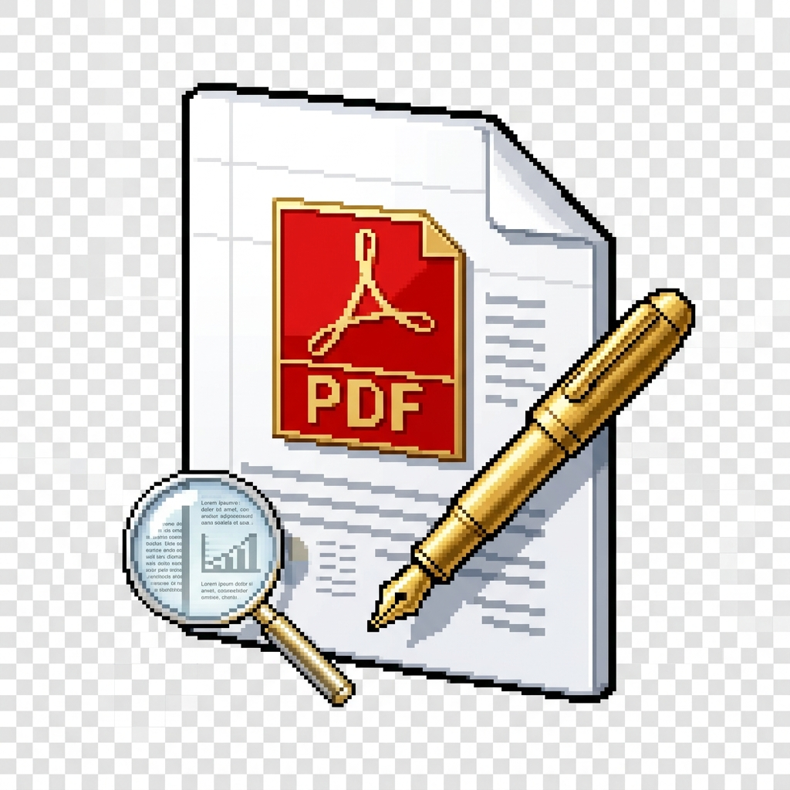

<p align="center">
  
</p>

# Freedeeeff (Free_dee_eff)

A modern, high-performance, native Windows desktop PDF reader, editor, OCR, and splitting application built with **WPF on .NET 8** and styled with **Windows 11 Fluent 2 Design (WPF-UI)**.

<p align="center">
  <a href="https://github.com/SUPERBEAK/Free_dee_eff/releases/latest">
    
  </a>
</p>

---

## 💾 Instant Download (No Compilation Needed)

To use Freedeeeff without building or compiling:

1. Go to the 👉 **[Releases Page](https://github.com/SUPERBEAK/Free_dee_eff/releases)**.
2. Download the latest **`Freedeeeff-win-x64.zip`**.
3. Extract the `.zip` file into any folder on your PC.
4. Double-click **`Freedeeeff.exe`** to launch!

---

## 🌟 Key Features

### 📖 High-Fidelity PDF Viewer
- **Ultra-Fast PDF Rendering**: Powered by Google PDFium (`Docnet.Core`) with razor-sharp vector rendering up to 400% zoom.
- **Viewing Modes**: Smooth continuous scrolling, zoom presets (Fit Width, Fit Page, 100%), and page rotation.
- **Page Thumbnails Sidebar**: Multi-page thumbnail previews, drag-reorder, and right-click actions.
- **Live Search (`Ctrl+F`)**: Hybrid document search querying native text streams (`PdfPig`) and OCR text layers with real-time match highlighting and navigation.

### 🔍 Native Windows OCR (`Windows.Media.Ocr`)
- **Zero Heavy External Dependencies**: 100% offline, hardware-accelerated text detection built into Windows 10/11.
- **On-Canvas Selectable Text**: Word- and line-level bounding box recognition allows selecting and copying text from scanned documents directly on the canvas.
- **OCR Text Inspector**: View full extracted text, word counts, and 1-click export to `.txt` files.

### ✍️ PDF Editing & Annotations
- **Text Fill Tool (`✍`)**: Click anywhere on a page to type in text boxes with custom font, size (10–32pt), bold, italic, and color.
- **Signatures Tool (`✒`)**:
  - **Draw**: Freehand ink signature with stroke smoothing and color selection.
  - **Type**: Cursive handwriting styles (Segoe Script, Lucida Handwriting, Gabriola).
  - **Upload**: Import image signature files (PNG/JPG).
  - **Saved Signatures**: Persistent signature library saved to `%LocalAppData%/Freedeeeff/Signatures/` for 1-click re-use across documents.
- **Highlighting (`🖍`)**: Semi-transparent rectangular highlighter in Yellow, Green, Cyan, or Pink.
- **Pen Tool (`✏`)**: Freehand ink annotations with customizable stroke color and width.
- **Shapes**: Rectangles, Ellipses, and Straight Lines.
- **Redaction (`⬛`)**: Permanent blackout and whiteout boxes to conceal sensitive identifiers.
- **Stamps (`🔖`)**: Pre-formatted badges ("APPROVED", "CONFIDENTIAL", "VOID", "DRAFT", "FINAL", "RECEIVED") with automatic date stamp.
- **Eraser Tool (`🧹`)**: Click to remove any annotation.
- **Undo (`Ctrl+Z`)** & **Print (`Ctrl+P`)**.

### ✂️ PDF Splitting & Merging Engine
- **Dedicated Split Dialog**:
  - **Split Every Page**: Burst all pages into individual single-page files (`Document_page_001.pdf`).
  - **Split by Ranges**: Custom segments like `1-3, 4-7, 8-10`.
  - **Split Every N Pages**: Chunk documents into fixed page counts.
  - **Extract Selected Pages**: Extract chosen pages directly from the thumbnail sidebar.
- **PDF Merge Dialog**: Combine multiple PDFs into a single file with custom ordering.

---

## 🛠️ Tech Stack & Architecture

- **UI Framework**: Modern WPF on .NET 8 (`net8.0-windows10.0.19041.0`)
- **Design System**: [WPF-UI](https://github.com/lepoco/wpfui) (Windows 11 Fluent 2 theme with Dark/Light modes)
- **PDF Rendering**: [Docnet.Core](https://github.com/GowenGit/docnet) (Native Google PDFium bindings)
- **OCR Engine**: Windows Runtime `Windows.Media.Ocr.OcrEngine` (Hardware-accelerated)
- **PDF Manipulation & Export**: [PDFsharp](https://github.com/empira/PDFsharp) & [PdfPig](https://github.com/UglyToad/PdfPig)
- **MVVM Framework**: [CommunityToolkit.Mvvm](https://github.com/CommunityToolkit/dotnet)

---

## 🚀 Getting Started

### Prerequisites
- Windows 10 (version 19041+) or Windows 11
- [.NET 8.0 SDK](https://dotnet.microsoft.com/download/dotnet/8.0) or higher

### Build & Run

Clone the repository and run:

```powershell
# Restore dependencies and build
dotnet build

# Run the application
dotnet run --project Freedeeeff.csproj
```

To build a Release binary:
```powershell
dotnet build -c Release Freedeeeff.csproj
```
The compiled executable will be located at:
`bin/Release/net8.0-windows10.0.19041.0/Freedeeeff.exe`

### Running Tests

```powershell
dotnet test tests/Freedeeeff.Tests
```

---

## 📄 License
This project is licensed under the MIT License.
